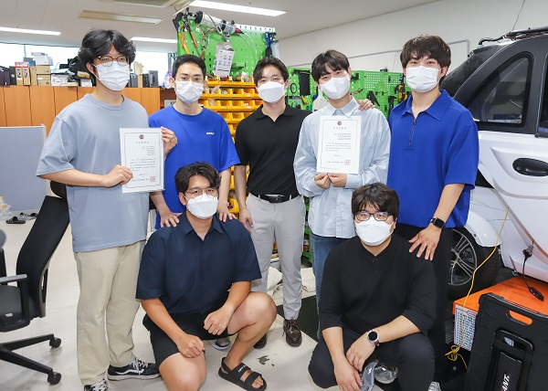

#### HCI연구실과 자율항법연구실 소속 연구원들 각각 연구결과 인정받아

**기존 객체 추적 알고리즘의 성능 높이는 알고리즘 개발** 
**저가의 라이다 센서로 높은 퀄리티의 결과 도출하는 알고리즘 고안**

컴퓨터공학과 권장우 교수가 이끄는 HCI연구실(Human Computer Interaction Lab)과 전기공학과 원종훈 교수의 자율항법연구실(Autonav Lab) 소속 연구원들이 ‘한국ITS학회’ 하계학술대회에서 우수논문상을 수상했다.

대학원 전기컴퓨터공학과 정회준 연구원 등 4명은 ‘S2TA: Super-resolution To Tracked Area’라는 논문으로, 전기공학과 최지원 연구원 등 4명은 ‘거리 기반 Sampling Algorithm을 이용한 LIDAR의 객체 인식 성능 개선에 관한 연구’라는 논문을 통해 우수논문상을 수상했다.

정회준 연구원 등 4명은 초해상화(Super Resolution)를 탐지하고자 하는 객체의 지점만 차별적으로 수행해 추적 성능은 높이고 연산량을 줄이는 알고리즘을 개발했다. 새로운 알고리즘은 보다 정확하고 빠른 객체 추적이 가능해, 이미지 화질이 낮은 상황에서 성능이 부족한 기존의 객체 추적(Tracking) 알고리즘의 문제를 해결했다.

최지원 연구원 등 4명은 수학적 기법을 통해 상대적으로 저가의 라이다(Lidar) 센서를 이용해 고가의 라이다 센서에서 기대할 수 있는 결과를 도출하는 알고리즘을 고안했다.

HCI연구실은 인간과 컴퓨터의 상호작용(HCI), 인공지능, 로보틱스(Robotics)에 관해 연구한다. 현재는 한국원자력연구원과 함께 진동 기반 이상 예측진단 인공지능 시스템을 구축 중이다. 또한 국립환경과학원과 연계해 인공지능 기반의 대기오염측정망 자료확정 자동화 알고리즘을 개발하고 있다.

자율항법연구실은 글로벌 위성항법시스템인 GNSS와 자율주행을 연구한다. 현재 다양한 정부과제 및 기업과제를 수행하며 미래 사회에서 사람들의 생활을 바꿀 수 있는 선행 연구를 진행하고 있다.

정회준 연구원은 “연구활동에 매진할 수 있도록 지원해주신 권장우 교수님과 연구에 도움과 지도를 주신 선배님들 그리고 연구를 도와준 후배들에게 고맙다”라며 “인공지능 연구와 개발에 힘써 학교의 학술역량 제고에 이바지하고 싶다”라고 소감을 말했다.

최지원 연구원은 “연구실에서 자율주행대회를 준비하면서 자율주행차의 객체인식에 있어 보다 나은 알고리즘을 고안했다”라며 “논문을 통해 학술대회의 우수논문상을 수상하게 되어 자율주행 분야에서 인정받은 것 같아 영광이다”라고 밝혔다.

지도교수인 권장우 컴퓨터공학과 교수는 “학생들의 노력과 열정이 우수논문상이라는 좋은 결과로 이어져서 매우 기쁘다”라고 전했으며, 원종훈 전기공학과 교수는 “수상한 학생들뿐만 아니라 모든 학생들이 각자의 분야에서 좋은 연구와 수학을 이어갈 수 있기를 바란다”라고 말했다.

[관련링크](https://www.inha.ac.kr/kr/952/subview.do?enc=Zm5jdDF8QEB8JTJGYmJzJTJGa3IlMkYxMSUyRjMxOTQyJTJGYXJ0Y2xWaWV3LmRvJTNGcGFnZSUzRDElMjZzcmNoQ29sdW1uJTNEYWxsJTI2c3JjaFdyZCUzRCVFQSVCNiU4QyVFQyU5RSVBNSVFQyU5QSVCMCUyNmJic0NsU2VxJTNEJTI2YmJzT3BlbldyZFNlcSUzRCUyNnJnc0JnbmRlU3RyJTNEJTI2cmdzRW5kZGVTdHIlM0QlMjZpc1ZpZXdNaW5lJTNEZmFsc2UlMjZwYXNzd29yZCUzRCUyNg%3D%3D)
